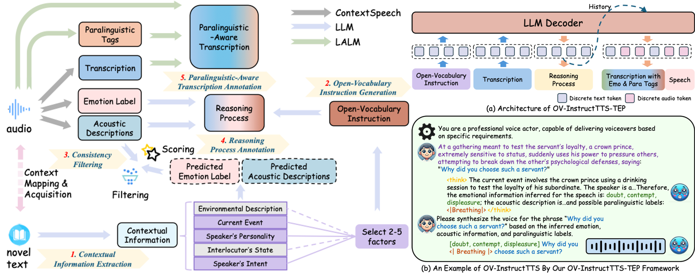

# STA-V2A: Video-to-Audio Generation with Semantic and Temporal Alignment (ICASSP 2025)

        🤗 <a href="https://huggingface.co/y-ren16/OVSpeech">Hugging Face</a>&nbsp&nbsp | &nbsp&nbsp🖥️ <a href="https://y-ren16.github.io/OV-InstructTTS">Demo</a> | &nbsp&nbsp📑 <a href="https://arxiv.org/pdf/2510.00000">Paper</a>&nbsp&nbsp
 

## 1. Introduction

Instruct Text-to-Speech (InstructTTS) leverages natural language descriptions as style prompts to guide speech synthesis. However, existing InstructTTS methods mainly rely on a direct combination of audio-related labels or their diverse rephrasings, making it difficult to handle flexible, high-level instructions. Such rigid control is insufficient for users such as content creators who wish to steer generation with descriptive instructions. To address these constraints, we introduce **OV-InstructTTS**, a new paradigm for open-vocabulary InstructTTS. We propose a comprehensive solution comprising a newly curated dataset, OV-Speech, and a novel reasoning-driven framework. The OV-Speech dataset pairs speech with open-vocabulary instructions, each augmented with a reasoning process that connects high-level instructions to acoustic features. The reasoning-driven framework infers emotional, acoustic, and paralinguistic information from open-vocabulary instructions before synthesizing speech. Evaluations show that this reasoning-driven approach significantly improves instruction-following fidelity and speech expressiveness. We believe this work can inspire the next user-friendly InstructTTS systems with stronger generalization and real-world applicability. The dataset and demos are publicly available on our project page.

- **Paradigm**: This paper proposes OV-InstructTTS, a novel paradigm that shifts instructTTS beyond its dependency on rephrased audio attributes, pushing controllable speech synthesis towards more flexible and user-friendly real-world applications.
- **Dataset**: We construct OV-Speech, a large-scale dataset providing a foundation for this paradigm. It features open-vocabulary instructions derived from narrative context, reasoning chains that connect instructions to acoustics, and transcriptions enriched with paralinguistic tags.
- **Method**: This paper proposes OV-InstructTTS-TEP, a novel reasoning-driven OV-InstructTTS framework based on LALM. Our method is designed to interpret open-ended instructions through a reasoning process to generate highly expressive speech that is consistent with the user's intent.
- **Experiments**: Extensive experiments and ablation studies demonstrate the value of our dataset and the effectiveness of the OV-InstructTTS-TEP framework. LLM-a-a-judge and subjective evaluations confirm the consistency of synthesized speech with open-ended instructions.

  

